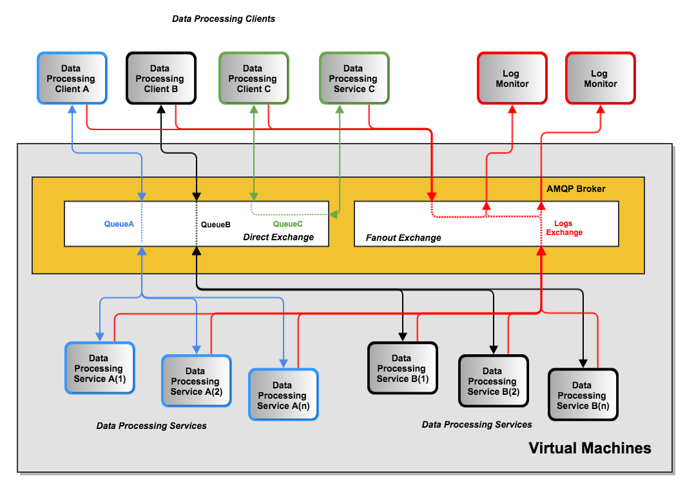
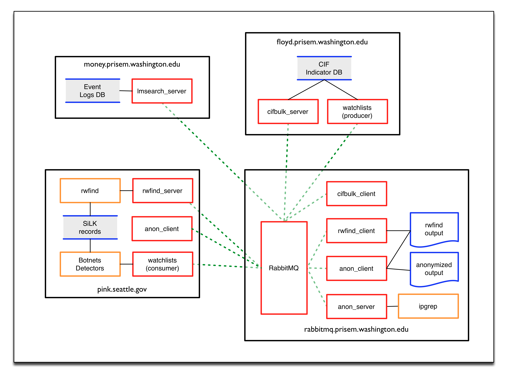

.. This file relies on rst_prolog being defined in conf.py. See
   the conf.py file in this directory for how this is done. In
   production, the rst_prolog string would be derived from a
   global configuration program, or included as a file that
   in turn is derived from a global configuraiton program.

.. _prisemdataquery:

.. include:: ../dimsvars.txt

PRISEM Data Query
=================

Introduction
------------

The PRISEM system collects data from a number of participating organizations,
correlates it, saves it in a database for archival purposes, and produces
alerts based on a number of factors. At the core is an instance of the
`Collective Intelligence Framework`_ (CIF) that is used to produce
watchlists for detectors, as well as to provide context about indicators
of compromise (IOCs) that are available from many sources.

Over the years, data query mechanisms were developed that allow
searching through archived network flow records, correlating
end points of connections with data in CIF, identifying
"friend" or "foe", and other data processing tasks. These
programs use an `AMQP`_ message bus architecture.

The server running |amqp_program| for AMQP message bus funtionality
used by the PRISEM system components for data query is |amqp_server|.
It provides AMQP access via TCP port |amqp_port| and is managed 
on TCP port |amqp_mgmt_port|.

This document describes the high level architecture, the data flows,
and the specifics for programs using the PRISEM data query
programs to process data.

PRISEM AMQP bus architecture
----------------------------

.. _PRISEM_bus_architecture:

   PRISEM |amqp_program| bus architecture

:ref:`PRISEM_bus_architecture` illustrates how |amqp_program| is
used for processing data held in various locations within the
PRISEM architecture.

The features shown in this figure are as follows:

* The boxes within the **gray box** labelled "Virtual Machines" are (surpise!)
  virtual machines. This includes two services **A** and **B**, as well as the
  |amqp_program| service itself. (For scalability and redundancy, the
  |amqp_program| service could be on separate hardware, but in a low-demand
  environment, it is acceptable to run everything depicted in this diagram
  within a single virtual machine hypervisor.)

* Within the amber box is the AMQP broker (in this case, |amqp_program|). Two
  separate exchange types are shown, a **direct exchange** and a **fanout
  exchange**.)

* Three separate data processing services are shown as boxes colored **green**,
  **blue**, and **black**. The **blue** (service **A**) and **black** (service
  **B**) services have multiple daemon processes available to handle
  high-volume requests when that is possible, while the **green** boxes depict
  a service that has a single service **C** on systems outside of the
  central virtual environment (e.g., `SiLK`_ data being stored on a remote
  system).

* The **red** boxes and lines depict a fanout exchange being used for logging
  activities. Every one of the **green**, **blue**, and **black** clients
  and servers all send information via the **red** fanout connections to
  the |amqp_program| service, which in turn sends a copy to every program
  that is listening to the specific fanout exchange (in this case, the
  "logs" exchange). Two external processes (the **red boxes** in the
  upper right of :ref:`PRISEM_bus_architecture`) will receive all of the
  logged events from all of the processes. This helps with debugging,
  monitoring the system, gathering processing statistics, and many other
  beneficial tasks.

PRISEM data flows
-----------------

.. _PRISEM_data_flows:

   PRISEM data flows through |amqp_server|

:ref:`PRISEM_data_flows` illustrates how various components within the PRISEM
architecture perform data processing using |amqp_program| services on
|amqp_server|. Elements within this diagram are as follows:

* **Black boxes** represents PRISEM system computing resources.  These can be
  either bare-metal computers, or virtual machines.  They are logically seen on
  the network as hosts with unique IP addresses, regardless of whether they are
  physical or virtual. (In the long run, they could all be virtual machines
  running in a "cloud" infrastructure. That is irrelevent to understanding how
  they function in terms of being clients or servers with a larger system of
  systems.)

  Within each of the black box systems, are processes that serve as either
  "clients" or "servers". In this sense, a "client" is a program that either
  (a) has some data and needs something done with that data, or (b) knows how
  to describe some data that it needs and requests some other "service" that
  holds the data to provide that data. Examples are asking for the records of
  every network flow between May 1, 2014 at 10:00 to May 2, 2014 at 23:45 that
  come from a specific set of IP addresses or network `CIDR`_ blocks, or to
  take the results of that query and anonymize them such that they can be
  shared with outside entities without exposing the organization who owns the
  computers associated with those flows.

* **Red boxes** are programs running as clients or daemons (services) that use
  |amqp_program| as a message bus for receiving and processing requests.

* **Blue lines around a gray block** are data sinks. These are either an actual
  database (e.g., Postgress, MySQL, Vertica, or some other relational or
  non-relational database), or are files stored in a filesytstem (e.g., `SiLK`_
  records, which are discrete binary files in a directory hierarchy). The
  **blue "sheets" of paper** in the bottom right **black box** depict
  files (in this case, output text files) that are obtained by clients
  calling services. The ``rwfind`` process obtains a text report of
  raw network flow records, then uses the ``anon_client`` to sends the
  file to the ``anon_service``, which (surpise!) anonymizes the file
  so it can be share outside of the group in anonymized form.

* **Amber boxes** are programs (either command line programs, or daemon
  processes running in the background) that perform some task. For example, the
  "ipgrep" box in the lower right hand corner of :ref:`PRISEM_data_flows` does
  anonymization, or generates statistics for cross-organizational correlation
  purposes, while the "Botnets Detectors" and "rwdfind" programs (respectively)
  produce or consume `SiLK`_ network flow records.

* **Solid black lines** are direct access between programs and data stores
  locally within a computer system.

* **Dashed green lines** between the red program boxes illustrate data flows
  between them as they use |amqp_program| to mediate the requests. The
  relationship between these programs is explained in more depth later in
  :ref:`PRISEM_bus_architecture`. The data that flows over these connections
  is described in more detail in :ref:`PRISEM_AMQP_commands`.

AMQP Data Processing Requests and Responses
-------------------------------------------

We know discuss how |amqp_program| is used by PRISEM for data processing
over AMQP.  Several AMQP (or AMQP-like) message bus architectures can support
this same mechanism, including `RabbitMQ`, `ZeroMQ`_, the Honeynet Project's
``hpfeeds``, etc. PRISEM uses |amqp_program|.

What does "data processing" mean in the context of PRISEM and DIMS?
~~~~~~~~~~~~~~~~~~~~~~~~~~~~~~~~~~~~~~~~~~~~~~~~~~~~~~~~~~~~~~~~~~~

The term "data processing" in this context is very simple. It means using
a structured command *request* and *response* data structure that acts like a
language, or protocol, for programs that want to ask for something to be done,
and for other programs to do those things and return the result to the
requesting program.

The AMQP message bus is used as a queueing mechanism for requests. This is done
for scalability. If one program can't handle the number of requests it receives
from programs needing the service it provides, you can add more programs to
provide that service. RabbitMQ handles managing the queue and handing out jobs
to workers. If the worker dies, and doesn't provide a response to the program
that needs a service, |amqp_program| will notice the failure to acknowledge the
request and give that request to another worker.

Why is this data processing mechanism important?
~~~~~~~~~~~~~~~~~~~~~~~~~~~~~~~~~~~~~~~~~~~~~~~~

The mechanism being used for remote procedure calling is designed to tie
together a bunch of different programs, written in different programming
languages, running on different computers, which are running different
operating systems, on different networks.... Get the point? It doesn't matter
what language some program is written in, or where it is running. If some
program needs to anonymize data, send it to the anonymization service. If
another program needs to look up a bunch of IP addresses in the Collective
Intelligence Framework database, send it to the CIF bulk query service. If some
program becomes the bottleneck, or the computer it is running on hits 90% CPU
utilization and slows things down, create a new virtual machine and off-load
processing of that service to the new VM. The data processing mechanism
provides scalability, flexibility, connectivity, and a bunch of other ity
things that you can't get easily any other way.

.. _PRISEM_AMQP_commands:

How does this data processing mechanism work?
~~~~~~~~~~~~~~~~~~~~~~~~~~~~~~~~~~~~~~~~~~~~~

It works by using a self-imposed standardized "protocol" or "language" for a
"client" and "service" to communicate. Again, this is really simple. Just think
about abstraction. Rather than every program having to know exactly how to
specify a command line, with options, arguments, etc., in the format required
by the underlying program you want to invoke, or requiring specific language
and operating system specific API calls over TCP/IP, think about a
(semi-handcuffing, or "least common denominator") intermediary "language" that
looks the same no matter what service you are asking for and that is easy to
parse with any programming language you want to use in order to provide that
service.

If you want a non-programming model, think about the air traffic control
system. Does every air traffic controller have to know every language spoken on
the planet Earth, where any arbitrary pilot who wants to fly a plane could have
grown up? Do they have to understand every word in those languages, so that
regional slang terms and words with multiple (possibly even conflicting)
meanings, do not result in trying to say "pull up!!!" to avoid crashing into a
plane below and having the pilot hear "slow down!!" which results in, well, you
get the idea. Of course not! That would never work and planes would be crashing
on a daily basis. What they decided to do was to standardize on everyone
speaking English, and even then, only a limited subset of English with specific
words that each have only one clear, unambiguous meaning. That allows any
plane, originating from any country, to land in any other country (provided
they have enough jet fuel to make it there).

So back to programming. This generalization allows for a much simpler way of
tying any two programs together that actually can scale and be extended quickly
and easily to new services. It has some shortfalls, but it also has some
powerful benefits. Go with the benefits and we'll figure out how to deal with
the shortfalls later. It is more important to get a bunch of things working
together than it is to develop the perfect new language that binds everything
in the world together. Read the `Cult of Done Manifesto`_ as a starting point
for moving forward rather than over-engineering things into prolonged stasis.

The standardized "protocol" is based on a high-level JSON structure that
defines a "command" and a "response," which also includes an
application-specific set of input and output data. The input and output data is
*not standardized*, since we are using the PRISEM data processing mechanism to
tie a bunch of underlying command line programs together, and they are all
written in a particular way, in particular languages, with particular command
line options and syntax. In other words, there is no "one size fits all" and it
is a waste of time to try to add data parsing for all possible programs that
want to ask for some service and have those all be supported in every service
that you could possibly want to use. That simply does not scale, and if you
didn't write every program yourself, or don't know how to modify every program
in every language, you will *never link them all together directly*. Get over
it. It isn't going to happen.  ---+ What does this protocol look like, and how
does it work?

Here is a command (request) structure for the CIF bulk service:
::

    { "appdata": { "etime": "1413619631", "noheader": "false", "searchfile":
    "NzcuMjIyLjQwLjQ0Cjk1LjIxNS4xLjIyMgoxNjIuMjEwLjEwMS4xNDIK", "stime":
    "1413014831" }, "hostname": "dddesktop", "name": "cifbulk", "pid": 4384,
    "pika_version": "0.9.8", "platform": "#25~precise1-Ubuntu SMP Thu Jan 30
    17:39:31 UTC 2014", "protocolver": "0.5", "release": "0.5.5", "time":
    1413590832 }

Here is what a response from the CIF bulk service looks like:
::

    { "appdata": { "retcode": 0, "stderr": "", "stdout": "eyJpZmYiOiAiZm9lIiwg[
    a ton of characters deleted... ]iAxNDEzNTkwODM2fQ="
        }, "hostname": "dddesktop", "name": "cifbulk", "pid": 4269,
        "pika_version": "0.9.8", "platform": "#25~precise1-Ubuntu SMP Thu Jan
        30 17:39:31 UTC 2014", "protocolver": "0.5", "release": "0.5.5",
        "time": 1413590836
    }

You will notice several fields in the top level of the JSON object that are common. Those are:

   * ``hostname`` - The short hostname (maybe should be fully qualified?) where the program is running. This is primarily to help identify which computer you have to log in to when you have to debug something that is broken.
   * ``name`` - The name of the service being used. (This is partly to ensure that commands aren't sent to the wrong queue, and partly for self-documentation.) Don't worry, just fill in this field with the right value.
   * ``pid`` - The process ID of program that is requesting/responding (primarily for finding a process to kill and/or debug if there is a problem)
   * ``pika_version`` (or other AMQP library that is being used) - This is just to identify the AMQP library being used, for debugging purposes primarily. Don't ask why, just note which AMQP library you are using so you can figure out why it broke.
   * ``platform`` - The operating system under which the client or service is running on (again, for debugging purposes, and don't ask why, just include this information in the request/response)
   * ``release`` - This one matters, or is supposed to matter. It is the version number of the command protocol
   * ``protocolver`` - This is the protocol version number (both this, and the ``release`` number, are related to semantic versioning for determining compatibility - if they don't match, don't expect things to work properly)
   * ``time`` (in Unix seconds from the epoch notation) - When was the request/response created (just for historic purposes, mostly related to debugging... do I need to say, "Don't worry about it, just put it in?")

Beyond those common fields, there is an ``appdata`` field that contains the input
and output data. In particular, ``appdata`` for a request contains the input
data, any options that are to be invoked, etc. There are no direct command line
arguments or options being passed (since these can create a security
vulnerability in the form of command injection). Instead, any required options
or arguments are specified in the JSON on a per-service basis. If there are
needed fields that are not there, we add them. (That is what "Agile
development" and "continuous integration" are for.)

In the example above of CIF bulk queries, the only options are:

   * ``etime`` - The "end time" of a time frame for the request (i.e., don't include anything after this time)
   * ``stime`` - The "start time" of a time frame for the request (i.e., don't include anything before this time)
   * ``noheader`` - Should header information be included?
   * ``searchfile`` - A BASE64 encoded string containing the input data (in this case, a list of search items for CIF)

In every case of the PRISEM data processing services, there are three elements to the ``appdata`` structure being returned. Those are:

   * ``stdout`` - The text (if any) that came out on the standard output file handle
   * ``stderr`` - the test (if any) that came out on the standard error file handle
   * ``retcode`` - The return code of the subordinate program that the service is front-ending (i.e., the program that ran in a sub-process, or the error result of the service if it isn't calling a subprocess to provide the service it is providing). It is just common decency to tell the calling program what happened, if something went wrong. ("No silent failures!")

One thing you will probably notice immediately is that the fields ``searchfile``,
``stdout``, and ``stderr`` all look like gibberish. They are BASE64 encoded
versions of the contents of the files in the filesystem that are sent to, and
received from, the services being invoked. This is to avoid any problems with
having to escape characters, etc. Again, don't ask why. Just BASE64
encode/decode any of these fields when using these data processing services.
That is how they work.

If any of this does not make sense, talk to Dave. If you think you know a
better way of doing things, make it work first, then suggest a way to improve
it later. It is more important to get something integrated into DIMS and
working than it is to make it perfect (or worse, sitting around half-finished).

Logging via AMQP
~~~~~~~~~~~~~~~~

In addition to the PRISEM data processing services, originally intended as a
means of debugging, is a logging fanout capability. The Python program used for
monitoring or sending messages on these fanouts is ``logmon`` and it works as
both a sender and receiver, depending on which command line options you use.The
default is to monitor messages on the selected fanout, and the default is the
``logs`` fanout.  (In AMQP terms, these messages are sent to an *exchange*, of
type *fanout*, so the term *fanout* is often used in talking about this logging
mechanism.)

The format for log messages used in DIMS employs the following fields:

   * Timestamp in `ISO 8601`_ format
   * The host where the message initiated (host name and/or IP address)
   * A GUID (as opposed to just a process ID)
   * The piece of code producing the log statement (e.g., a classname, or where do you look in the codebase should an error arise)
   * The logging level (``INFO``, ``DEBUG``, ...)
   * The log message (i.e. what was being said)

To help map the GUID to a process, in the case of multiprocessing with multiple
instances of the same program running, it is important to map process ID (PID)
to GUID, so initiating a process should generate a log message that includes
all of these attributes for linking.

::

    2014-11-05T16:52:16-0800 rejewski 431270e5-b42a-4625-801d-1777dd9eff81 edu.uw.apl.tupelo.http.server.AttributesServlet DEBUG 'Get.PathInfo: /get/32m/20141029.0023/md5'
    2014-11-05T16:52:16-0800 rejewski 431270e5-b42a-4625-801d-1777dd9eff81 edu.uw.apl.tupelo.http.server.AttributesServlet DEBUG 'getAttribute.details: '32m/20141029.0023/md5''
    2014-11-05T16:52:16-0800 rejewski 431270e5-b42a-4625-801d-1777dd9eff81 edu.uw.apl.tupelo.http.server.AttributesServlet DEBUG 'Get.ServletPath: /disks/attr'
    2014-11-05T16:52:16-0800 rejewski 431270e5-b42a-4625-801d-1777dd9eff81 edu.uw.apl.tupelo.http.server.AttributesServlet DEBUG 'Get.PathInfo: /get/64m/20141028.0029/md5'
    2014-11-05T16:52:16-0800 rejewski 431270e5-b42a-4625-801d-1777dd9eff81 edu.uw.apl.tupelo.http.server.AttributesServlet DEBUG 'getAttribute.details: '64m/20141028.0029/md5''
    2014-11-05T16:52:16-0800 rejewski 431270e5-b42a-4625-801d-1777dd9eff81 edu.uw.apl.tupelo.http.server.AttributesServlet DEBUG 'Get.ServletPath: /disks/attr'
    2014-11-05T16:52:16-0800 rejewski 431270e5-b42a-4625-801d-1777dd9eff81 edu.uw.apl.tupelo.http.server.AttributesServlet DEBUG 'Get.PathInfo: /get/32m/20141029.0019/md5'
    2014-11-05T16:52:16-0800 rejewski 431270e5-b42a-4625-801d-1777dd9eff81 edu.uw.apl.tupelo.http.server.AttributesServlet DEBUG 'getAttribute.details: '32m/20141029.0019/md5''
    2014-11-05T17:01:53.628154-08:00 27b-6.local 76f1f5bb-19b2-4696-adbc-b5598cb35d1a logmon INFO #!/usr/bin/env python
    2014-11-05T17:01:53.628483-08:00 27b-6.local 76f1f5bb-19b2-4696-adbc-b5598cb35d1a logmon INFO 
    2014-11-05T17:01:53.628688-08:00 27b-6.local 76f1f5bb-19b2-4696-adbc-b5598cb35d1a logmon INFO import time
    2014-11-05T17:01:53.628883-08:00 27b-6.local 76f1f5bb-19b2-4696-adbc-b5598cb35d1a logmon INFO import sys
    2014-11-05T17:01:53.639685-08:00 27b-6.local 76f1f5bb-19b2-4696-adbc-b5598cb35d1a logmon INFO import os
    2014-11-05T17:01:53.639962-08:00 27b-6.local 76f1f5bb-19b2-4696-adbc-b5598cb35d1a logmon INFO import fileinput
    2014-11-05T17:01:53.640163-08:00 27b-6.local 76f1f5bb-19b2-4696-adbc-b5598cb35d1a logmon INFO from optparse import OptionParser
    2014-11-05T17:01:53.650940-08:00 27b-6.local 76f1f5bb-19b2-4696-adbc-b5598cb35d1a logmon INFO 

The log levels parallel those of Unix ``syslog(5)``. The strings are all upper case (e.g., ``INFO``). The levels and their respective values are as seen in this list. If not specified, the level will be ``INFO``:

::

     Emergency     (level 0)
     Alert         (level 1)
     Critical      (level 2)
     Error         (level 3)
     Warning       (level 4)
     Notice        (level 5)
     Info          (level 6)
     Debug         (level 7)

Reference Python data procssing clients
~~~~~~~~~~~~~~~~~~~~~~~~~~~~~~~~~~~~~~~

The PRISEM system has a set of Python reference data processing clients that
were written to provide data processing services across multiple components of
the Log Matrix system, extending out to command line clients outside of the
system via a Virtual Private Network (VPN) connection. These clients serve as
examples of how to make AMQP calls as a client to request a service, and how to
take the requests off the AMQP bus, process them, and return the results to the
client that made the request. Other programs that need to access services have
the option of creating a subprocess that invokes one of the Python clients (if
you only know how to make subprocess calls and not AMQP calls), or the
programmer can take advantage of the `very well-documented RabbitMQ client
examples`_ to do your own data processing calls in other languages besides
Python.  The task, then, is understanding how to specify the inputs, select
options, and process the resulting output, by processing JSON structures being
passed over the AMQP bus.

.. _AMQP: http://www.amqp.org/
.. _Collective Intelligence Framework: https://code.google.com/p/collective-intelligence-framework/
.. _CIDR: http://en.wikipedia.org/wiki/Classless_Inter-Domain_Routing
.. _SiLK: https://tools.netsa.cert.org/silk/
.. _ZeroMQ: http://zeromq.org/
.. _RabbitMQ: http://www.rabbitmq.com/
.. _Cult of Done Manifesto: http://www.brepettis.com/blog/2009/3/3/the-cult-of-done-manifesto.html
.. _ISO 8601: http://www.w3.org/TR/NOTE-datetime
.. _very well-documented RabbitMQ client examples: https://www.rabbitmq.com/documentation.html
